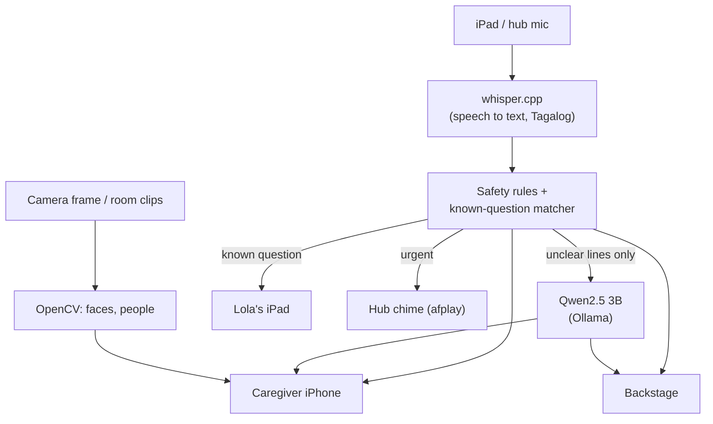
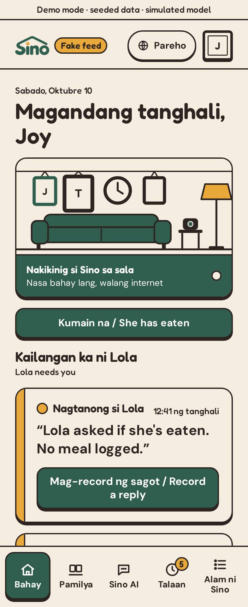
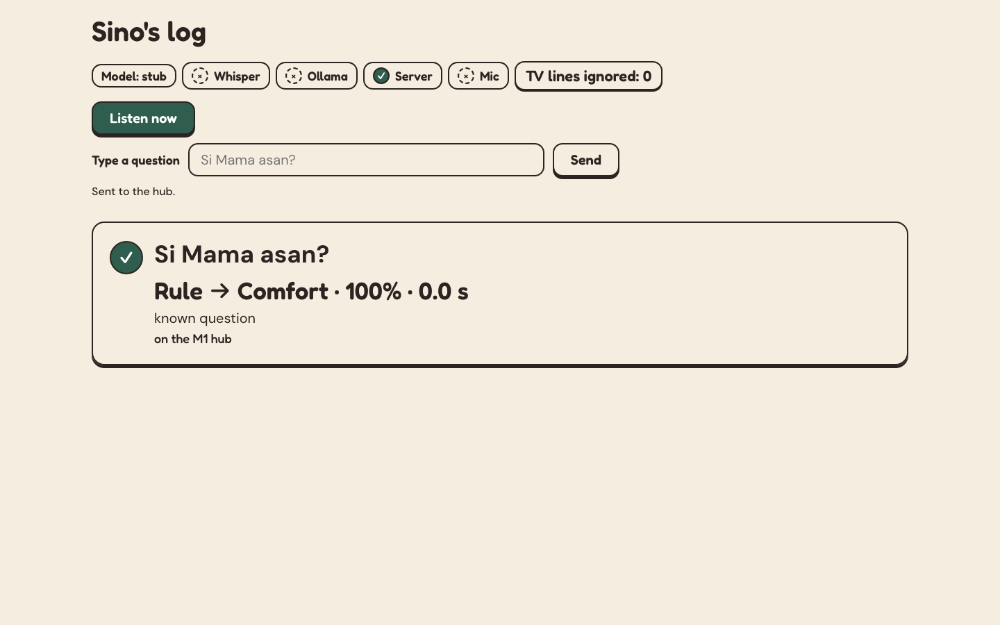

<div align="center">

# Sino


**When someone with dementia asks the same question again, Sino answers in the family's own voice. No internet needed.**

https://github.com/user-attachments/assets/f177404b-7fa0-44b6-86a9-62e6333fe82a

<sub>▶ 64-second demo. Turn the sound on.</sub>

[**Try the live demo**](https://sino-demo.onrender.com) · [**Read the spec**](docs/sino/README.md) · [**See every feature**](docs/sino/features.md)

<sub>The live demo is simulated with seeded data. It sleeps when idle, so the first load can take about 50 seconds.</sub>

</div>

---

## Why Sino

Lola asks "Nasaan si Nanay?" ten times a day. Her mother passed away years ago. Every answer is a choice: tell her the truth again and watch her grieve, or find something gentle to say. By the tenth time, even the most patient family runs out.

Sino lets the family answer once and keep answering. They record what they want her to hear, in their own voices. After that, when Lola asks, she hears her daughter's voice, with the same warmth every time.

**It has to be local.** A microphone that listens all day inside someone's home must never send that audio anywhere. So the speech recognition and the AI that decides what to do both run on a small hub in the house. Cut the internet and Sino keeps working; the hub and screens only need the home network.

## What it does

- **Answers in the family's voice.** A known question plays a reply the family recorded, full screen on Lola's iPad, with their photo when one is added. No text-to-speech and no voice cloning, ever.
- **Knows when not to answer.** Every line Sino hears gets one of four outcomes: comfort her, quietly tell the caregiver, raise an urgent alarm, or stay silent. Anything about medicine always goes to the caregiver. When Sino isn't sure, it asks a person instead of guessing.
- **Sounds the alarm on real danger.** "Masakit dibdib ko," "natumba ako," "tulong": pain, falls, and trouble breathing ring a red alert on the caregiver's phone with Lola's exact words, until someone taps "Papunta na ako / On my way." Only fixed safety rules can raise an alarm, not the AI model, and the family can add their own safety words.
- **Stays quiet for the TV.** Known TV words and lines, like "teleserye," "abangan," and "Salamat sa panonood," are ignored, so a show in the background doesn't get answered. A real urgent word still wins.
- **Remembers meals so she doesn't have to.** The caregiver taps "Kumain na" after a meal. If Lola asks "Kumain na ba ako?", Sino reassures her. If no meal was logged, it never tells her she hasn't eaten; it quietly asks the caregiver to check.
- **Tells her who's there.** For "Sino ka?", Sino looks at one camera frame, and if it's sure the face belongs to an enrolled family member, it plays that person's recorded line. If it isn't sure, it plays a safe default and never names the wrong relative.
- **Answers "how is Lola today?"** On the caregiver phone, the family asks in plain Taglish or English: "Kamusta si Lola?" or "Ano ang mga tanong niya?" Sino answers from the day's log with counts, her exact words, and any alerts, and says plainly that it's not a diagnosis.
- **Looks for Lola in recorded clips.** "Nasaan si Lola?" checks video already recorded on the hub, highlights the person it found, and answers in the past tense: "Huling nakita sa recording: Kainan." It is a demo of recorded clips, not live CCTV.
- **Lets the family teach it.** From the caregiver phone: add a question, add how Lola says it, hold to record the reply. A reply recorded on a yellow card plays on Lola's iPad right away.
- **Shows its work.** A behind-the-scenes screen lists every line Sino heard: the transcript, whether a rule or the model decided, what it did, how sure it was, and how long it took.

## How it works



Everything in that picture runs inside the house, on one Mac acting as the hub. Rules go first: urgent words, medication, TV lines, then the known-question matcher. The local model only weighs in on lines the rules can't settle, and if it is slow, or not confident enough to stay silent, the line goes to a person. The three screens are web pages served by the hub over the home network.

## Three screens

| Screen | Device | What it shows |
|---|---|---|
| **Lola** (`/lola`) | iPad | A big clock and a family photo. When she asks, the family's photo and recorded voice, full screen. No menus, nothing to type, never red. |
| **Caregiver** (`/caregiver`) | iPhone | Red cards for urgent, yellow for "Lola needs you," green for comforted. Record a reply, log a meal, add a family member or safety word, ask Sino about Lola. |
| **Backstage** (`/backstage`) | Mac | Every decision, line by line, with an OFFLINE badge, a health light for each part, and a box to type a test question. |

<p align="center">
  
  &nbsp;&nbsp;
  
</p>
<p align="center"><sub>Left: the caregiver phone home screen, with a "no meal logged" card waiting for the family. Right: backstage, showing a rule decide a known question.</sub></p>

## Try it

**In your browser:** open the [live demo](https://sino-demo.onrender.com) and press **Try it in 60 seconds**. It walks through five moments on one simulated day: a repeated question, a TV line, a meal, an urgent line, and "Kamusta si Lola?" Every view is labeled "Demo mode · seeded data · simulated model": no microphone, no AI model, nothing real is heard.

**On your own machine, no models needed:**

```bash
# the decision rules, standard library only
SINO_MODEL=stub python3 brain/tests/run_t5.py
```

## Run it at home

<details>
<summary><b>Full hub setup on a Mac</b> (whisper.cpp, Ollama, HTTPS, offline network)</summary>

<br>

Sources: [DONITA-SETUP.md](docs/sino/DONITA-SETUP.md), [hub/start.sh](hub/start.sh), [architecture.md](docs/sino/architecture.md#running-the-hub-server).

**What runs where.** One Mac (ours: MacBook Air M1, 8 GB) runs whisper.cpp (Whisper small, Tagalog, Silero VAD), Ollama `qwen2.5:3b`, and the FastAPI hub (`brain/server.py`), which serves the three screens over HTTPS on the home network.

**Prerequisites.** [Homebrew](https://brew.sh), then `brew install git cmake ffmpeg mkcert node python ollama`. About 10 GB of free disk. Download everything before you turn the firewall on.

1. **Speech model**, in `~/sino/whisper.cpp` (where `hub/start.sh` looks):
   ```bash
   mkdir -p ~/sino && cd ~/sino
   git clone https://github.com/ggml-org/whisper.cpp.git && cd whisper.cpp
   sh ./models/download-ggml-model.sh small
   sh ./models/download-vad-model.sh silero-v6.2.0
   cmake -B build && cmake --build build -j --config Release
   ```
2. **Decision model:** start Ollama, then `ollama pull qwen2.5:3b`.
3. **Hub packages:**
   ```bash
   python3 -m venv ~/sino/hub-venv
   ~/sino/hub-venv/bin/pip install \
       fastapi 'uvicorn[standard]' python-multipart websockets
   ```
   Face match and the recorded-clip search also need `~/sino/hub-venv/bin/pip install -r brain/requirements.txt` (OpenCV). Without it, face match reports `engine: "missing"` and saves nothing.
4. **Caregiver screen:** `cd web/caregiver && npm ci && npm run build`.
5. **HTTPS certificate** (Safari only allows the iPad mic over HTTPS):
   ```bash
   mkcert -install && mkdir -p ~/sino/certs
   mkcert -cert-file ~/sino/certs/hub.pem \
          -key-file ~/sino/certs/hub-key.pem \
          <hub-ip> localhost
   ```
   AirDrop `rootCA.pem` (in the folder `mkcert -CAROOT` prints) to the iPad and iPhone, install it, and trust it under Settings → General → About → Certificate Trust Settings.

**Network.** A phone's Personal Hotspot is the house network (turn on Maximize Compatibility), and a LAN-only firewall on the hub blocks the internet. Get the hub IP with `ipconfig getifaddr en0`, then set up the firewall exactly as in [DONITA-SETUP.md §5](docs/sino/DONITA-SETUP.md#5-network-d1).

**Run**, from the repo root:

```bash
hub/start.sh        # start everything, load qwen2.5:3b, print the health light
hub/start.sh status # health light only
hub/start.sh stop   # stop what start.sh started
```

Then open the screens on the same network:

| Device | URL |
|---|---|
| iPad (Lola) | `https://<hub-ip>:8000/lola/?feed=hub`, tap **Simulan**, allow the mic, set Auto-Lock to Never |
| iPhone (caregiver) | `https://<hub-ip>:8000/caregiver/?feed=hub`, keep it open (no internet means no push notifications) |
| Mac (backstage) | `https://<hub-ip>:8000/backstage/?feed=hub` |

Settings are environment variables listed in [.env.example](.env.example), e.g. `ALWAYS_LISTEN=1 hub/start.sh`.

**Without the hardware:** `SINO_MODEL=stub ~/sino/hub-venv/bin/python brain/server.py`, then open `http://localhost:8000/backstage/?feed=hub`, type `Nasaan si Nanay?`, and watch `http://localhost:8000/lola/?feed=hub` (tap Simulan first).

**Tests** (stub mode, no mic):

```bash
SINO_MODEL=stub python3 brain/tests/run_t5.py
SINO_MODEL=stub ~/sino/hub-venv/bin/python brain/tests/test_server.py
for t in hub/tests/test_*.py; do ~/sino/hub-venv/bin/python "$t" || break; done
node web/fake-feed/check.mjs
node web/lola/mic.test.mjs
```

**Public demo deploy.** The hosted demo runs from the `troy/public-demo` branch on Render's free tier. Steps: [deploy.md on that branch](https://github.com/Troy-LL/appsolutely/blob/troy/public-demo/docs/sino/deploy.md).

</details>

## Built with

[whisper.cpp](https://github.com/ggml-org/whisper.cpp) (Whisper small + Silero VAD) · [Ollama](https://ollama.com) with Qwen2.5 3B · FastAPI · OpenCV (YuNet + SFace for faces, MobileNet-SSD for people in clips) · React + Vite for the caregiver phone · plain HTML for Lola's screen and backstage.

## Team

| Builder | GitHub |
|---|---|
| **Troy Lazaro** | [@Troy-LL](https://github.com/Troy-LL) |
| **Donita Salonga** | [@DonitaSalonga](https://github.com/DonitaSalonga) |
| **Viviene** | [@jwiwooyang](https://github.com/jwiwooyang) |
| **Ayen Mejorada** | [@AyenMejorada](https://github.com/AyenMejorada) |

Sino started at the AppBuildersPH Hackathon 2026. It's our own project now.

## Thank you

Sino started as a hackathon idea and became something we actually care about. To Donita, Viviene, and Ayen: thank you for building this with me, through the late nights, the broken hubs, and every "wait, it works now." And thank you to Joy for lending Sino her voice. I loved this problem, I loved this idea, and I loved building it with you. — Troy

## Disclosures

<details>
<summary>Models, tools, data, and AI help we used</summary>

<br>

- **Models:** Whisper small via whisper.cpp with Silero VAD, and Qwen2.5-3B in Ollama, on an M1 (8 GB) hub. Face match uses OpenCV YuNet + SFace on the hub CPU. The recorded-clip search uses OpenCV DNN MobileNet-SSD (person class only). Live CCTV and voice ID were cut. There is no text-to-speech and no voice cloning.
- **No cloud AI.** The home hub calls no model API. The test clips in `brain/tests/audio/lola/` were made with ElevenLabs before the event as synthetic test input only. Sino never uses them to talk to anyone.
- **Voices and media:** every reply Lola hears is a real human recording. Joy recorded the four comfort replies and three meal clips, and Troy, Joy, and Donita each recorded a "Sino ka?" line. The three room clips in `brain/clips/media/` are demo footage: someone playing Lola at the dining table, and an empty staircase and balcony. `brain/seed.json` is demo data.
- **Tools:** ffmpeg, mkcert, macOS `afplay` (urgent chime), headless Chrome and Playwright for tests and the simulated demo recording only. Fonts: Fredoka and DM Sans (OFL).
- **Hosting:** the public demo is on Render's free tier. It's a web host, not a model API, and the demo is simulated: stub decisions, seeded data, no Ollama, no microphone.
- **AI development tools:** Claude Code, Cursor, Grok Bot, and Kiro helped write code and docs. Kiro built Lola's iPad screen. Claude Code wrote the Lola reply-playback browser test and the fix it found. Cursor placed the logo across the screens, wired the caregiver's urgent reply to the iPad, fixed enrolled face photos and hub state after a restart, wrote the simulated demo recorder, and fixed reply auto-play after the Simulan tap.

</details>

<p align="center"><sub>For contributors: <a href="docs/INDEX.md">docs/INDEX.md</a> lists every doc and who owns it. <a href="AGENTS.md">AGENTS.md</a> has the rules for AI coding assistants.</sub></p>
