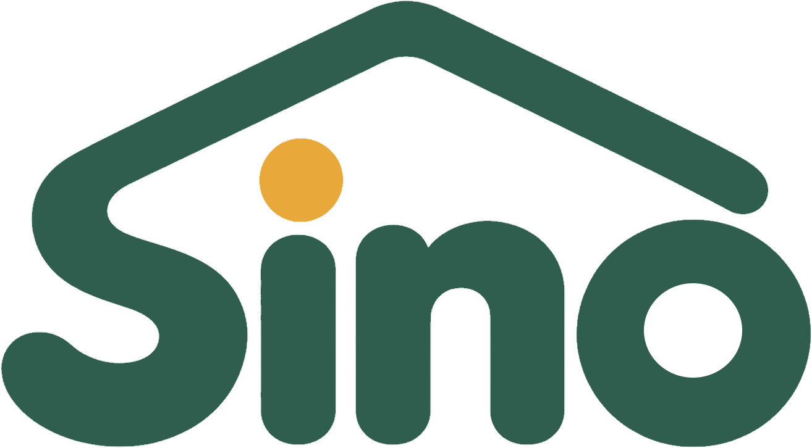

# Appsolutely



Team repo for the **AppBuildersPH Hackathon 2026** (Team Appsolutely: Troy, Ayen, Donita, Viviene). It holds the planning docs (event facts, roles, philosophy, playbook, idea filter, submission checklist) and the Sino spec in `docs/sino/`. Per the rules, the project is built from scratch after the challenge reveal at 1:00 PM Fri Oct 9.

## Our project: Sino

Sino is a small home hub that answers a lola's repeated questions in her family's own recorded voice, decides when to comfort her, get the caregiver, or raise an alarm, and keeps working with no internet. An always-on mic in a home must never stream anywhere, so speech recognition (whisper.cpp) and the decision model (Qwen2.5 in Ollama) run on a home device. Spec: **[docs/sino/README.md](docs/sino/README.md)**.

## Disclosures (running list, updated as we build)

- **Models:** Whisper small via whisper.cpp + Qwen2.5-3B (Ollama) on an M1 (8 GB) hub; fallback Whisper medium + Qwen2.5-1.5B only if small's Tagalog is unusable (final pick logged in docs/NOTES.md), Silero VAD. Face match on the hub CPU uses OpenCV YuNet + SFace when OpenCV is installed (`POST /face/frame`, `POST /face/enroll/<person>`); if it is missing, enrollment returns `engine: "missing"` and writes nothing. Recorded-clip "where" uses OpenCV's HOG people detector on files in `brain/clips/media/`. Live CCTV and voice ID stay cut (see `docs/sino/features.md`). No text-to-speech or voice cloning. Update this list to what was actually used.
- **Frameworks and tools:**
  - `python-multipart` (file uploads on the hub).
  - `ffmpeg` (records the hub mic for "listen now"; whisper-server also uses it to convert audio).
  - whisper.cpp `whisper-server` (serves Whisper small to the hub at `127.0.0.1:8080`).
  - macOS `afplay` (built in; plays the system sound `Glass.aiff` as the urgent chime on the hub speaker).
  - `curl` and `openssl` (macOS built-ins) and `mkcert` (local HTTPS certificates), used by `hub/start.sh` for the health light and the certificate check.
  - Google Chrome, headless (test only, not part of the app): `web/lola/reply.test.py` drives it over the DevTools protocol, offline on `127.0.0.1`, to test how Lola's screen plays family replies.
  - Playwright (Python, demo only, not part of the running app): `demo/sim/record.py` drives the three screens and records a simulated walkthrough. `ffmpeg` composes that film.
  - TODO, add the rest as each is introduced.
- **APIs and cloud services:** none at runtime. Test clips in brain/tests/audio/lola/ were generated before the event with ElevenLabs (synthetic, test input only; Sino itself runs offline).
- **Existing code and assets:** open-source libraries only. Demo data (`brain/seed.json` and the teammate-recorded replies and photos) is labeled as demo data. The default replies in `brain/media/` are real human recordings: Joy's four comfort replies and three meal clips, and the three "Sino ka?" lines by Troy, Joy, and Donita (no ElevenLabs, no text-to-speech). The three demo room clips in `brain/clips/media/` (`dining.mp4` Kainan, `stairs.mp4` Hagdan, `balcony.mp4` Balkonahe) are in the clone: a person playing Lola sits at the dining table, and the staircase and balcony have no person. `.mov` and `.webm` with the same English stem count too (`stairs.MOV`, `dining.MOV`, `balcony.MOV`). Other files in that folder stay gitignored. `/backstage` serves the Fontsource OFL files already in `web/backstage/fonts/` (Fredoka 500/600, DM Sans 400/500/700). Official mark: `assets/brand/sino-logo.png` (house roofline, green word, amber dot on the i), plus the trimmed web copies next to it. No new runtime dependency.
- **AI development tools:** Claude Code, Cursor, Grok Bot, Kiro (plus the Figma MCP if used). Kiro built Lola's iPad screen (`web/lola/`). Cursor placed the official mark in the READMEs, the favicons, the caregiver top bar, the backstage header, and the Lola idle corner. Claude Code wrote the Lola reply-playback browser test (`web/lola/reply.test.py`) and the tap-retry fix it found in `web/lola/lola.js`. Cursor (Grok) wired the caregiver's urgent reply through the hub to Lola's iPad. Cursor (Grok 4.7) fixed enrolled face photos on the family frames and made hub writes show again after a browser refresh or a hub restart. Cursor (Grok) wrote the simulated demo recorder in `demo/sim/record.py`. Cursor (Grok 4.7) fixed Lola's iPad so a recorded reply auto-plays after the one Simulan tap.

## Key dates (PH time, UTC+8)

| When | What |
|---|---|
| Fri Oct 9, 12:30 PM | Online room opens (12:45 PM briefing) |
| Fri Oct 9, 1:00 PM | Challenge reveal. Build starts. |
| Fri Oct 9, 4:00 PM | Pivot lock (no idea changes after this) |
| Sat Oct 10, 3:30 AM | Sino MVP freeze (moved from 2:00 AM; see `docs/sino/mvp-plan.md`) |
| Sat Oct 10, 7:00 AM | Feature freeze (team rule) |
| Sat Oct 10, 8:30 AM | Our submit target (team rule) |
| Sat Oct 10, 10:00 AM | **Submissions close. Repo must be public. No extensions.** |
| Sat Oct 10, 12:00 PM | On-site at Cyberzone, SM Makati (required for finals) |

## Start here

- **[docs/INDEX.md](docs/INDEX.md)**: every doc, who owns it, when to read it, plus the glossary.
- **[AGENTS.md](AGENTS.md)**: rules for AI coding assistants working in this repo.

## Setup

Sources: [DONITA-SETUP.md](docs/sino/DONITA-SETUP.md), [hub/start.sh](hub/start.sh), [architecture.md](docs/sino/architecture.md#running-the-hub-server), [demo.md](docs/sino/demo.md#setup-before-going-on-stage).

### What runs where

- **Hub:** one Mac (ours: MacBook Air M1, 8 GB) runs everything locally: whisper.cpp (Whisper small, `-l tl`, Silero VAD), Ollama `qwen2.5:3b`, and the FastAPI hub server (`brain/server.py`), which serves the three screens over HTTPS on the home network. No cloud service at runtime.
- **Screens:** iPad = Lola's screen and main mic (`/lola`), iPhone = caregiver (`/caregiver`), Mac = behind the scenes (`/backstage`).

### Prerequisites (on the Mac)

- [Homebrew](https://brew.sh), then `brew install git cmake ffmpeg mkcert node python ollama`. Our hub runs Ollama from Homebrew ([NOTES.md](docs/NOTES.md)); the app from ollama.com also works (DONITA-SETUP §3).
- Python 3 for the hub's venv (ours is Python 3.13) and Node + npm for the caregiver build. About 10 GB free disk.
- Do every download below **before** you turn the firewall on.

### One-time setup

1. Speech model, in `~/sino/whisper.cpp` (where `hub/start.sh` looks):
   ```bash
   mkdir -p ~/sino && cd ~/sino
   git clone https://github.com/ggml-org/whisper.cpp.git && cd whisper.cpp
   sh ./models/download-ggml-model.sh small            # models/ggml-small.bin
   sh ./models/download-vad-model.sh silero-v6.2.0     # models/ggml-silero-v6.2.0.bin
   cmake -B build && cmake --build build -j --config Release
   ```
2. Decision model: start Ollama (`ollama serve` in another terminal, or the app), then `ollama pull qwen2.5:3b`.
3. Hub Python packages, in the venv `hub/start.sh` uses:
   ```bash
   python3 -m venv ~/sino/hub-venv
   ~/sino/hub-venv/bin/pip install fastapi 'uvicorn[standard]' python-multipart websockets
   ```
4. Caregiver screen. The hub serves `web/caregiver/dist` at `/caregiver` if it exists when the server starts:
   ```bash
   cd web/caregiver && npm ci && npm run build
   ```
5. HTTPS certificate (Safari gives the iPad mic only over HTTPS). Get `<hub-ip>` from the Network step first:
   ```bash
   mkcert -install
   mkdir -p ~/sino/certs
   mkcert -cert-file ~/sino/certs/hub.pem -key-file ~/sino/certs/hub-key.pem <hub-ip> localhost
   ```
   AirDrop `rootCA.pem` (in the folder `mkcert -CAROOT` prints) to the iPad and iPhone, install it, then turn it on under Settings → General → About → Certificate Trust Settings. If the hub IP changes, make the certificate again; `hub/start.sh status` warns when it no longer matches.

### Network (offline)

A phone's Personal Hotspot is the house network, and a LAN-only firewall on the hub blocks the internet ([architecture.md](docs/sino/architecture.md#network)).

1. Phone: Settings → Personal Hotspot → Allow Others to Join on, **Maximize Compatibility on**. Join it from the Mac, iPad, and iPhone.
2. Hub IP: `ipconfig getifaddr en0` (usually `172.20.10.x`).
3. Create `/etc/pf.anchors/sino` and `/etc/pf.sino.conf` exactly as in [DONITA-SETUP.md §5](docs/sino/DONITA-SETUP.md#5-network-d1). Then:
   ```bash
   sudo pfctl -f /etc/pf.sino.conf -e   # firewall on: local network only
   curl -m 3 https://google.com         # must time out
   sudo pfctl -d                        # firewall off (before downloading anything)
   ```

### Run

From the repo root on the hub:

```bash
hub/start.sh          # start what is not running, load qwen2.5:3b, print the health light
hub/start.sh status   # health light only (starts nothing)
hub/start.sh stop     # stop only what start.sh started
```

`start.sh` starts Ollama, whisper-server on `127.0.0.1:8080` (Whisper small, `-l tl`, Silero VAD when its model file is there), and `brain/server.py` over HTTPS on port 8000 with `SINO_MODEL=ollama`, then pings the model every 60 s to keep it loaded. The health light shows Whisper, AI model, hub server, microphone, and offline, plus the hub URL for the iPad and phone. If a part fails, it names the part and its log (`~/sino/logs/<part>.log`) and exits non-zero. It never turns the firewall on or off. macOS asks once for microphone access for your terminal app: allow it.

Settings are environment variables (names in [.env.example](.env.example)). Nothing reads a `.env` file, so set them on the command line, e.g. `ALWAYS_LISTEN=1 hub/start.sh`. A part that is already running is left alone, so run `hub/start.sh stop` before changing one.

| Variable | Default | What it does |
|---|---|---|
| `SINO_MODEL` | `stub` in `brain/server.py`; `hub/start.sh` always uses `ollama` | `stub` = rules + matcher only; `ollama` adds Qwen for unclear lines |
| `ALWAYS_LISTEN` | `0` | `1` = the hub's own mic listens all the time (the iPad mic is separate) |
| `CHIME` | on | `0` turns off the urgent chime on the hub speaker |
| `VAD_PAD_MS` | `200` | audio Silero VAD keeps around speech, in ms |
| `WHISPER_HINT` | off | `1` sends the known questions to Whisper as a prompt |

### Open the screens

| Device | URL | Then |
|---|---|---|
| iPad (Lola) | `https://<hub-ip>:8000/lola/?feed=hub` | Tap **Simulan**, then **Allow** the microphone. Set Auto-Lock to Never. |
| iPhone (caregiver) | `https://<hub-ip>:8000/caregiver/?feed=hub` | Keep it open: with no internet there are no push notifications. |
| Mac (behind the scenes) | `https://<hub-ip>:8000/backstage/?feed=hub` | Each line: transcript → rule or model → action → ms. Has "Listen now" and a typed-question box. |

Without `?feed=hub`, each screen plays a scripted practice feed (`web/fake-feed`) and shows a FAKE tag.

### Try it without the hardware

- Decision rules only, standard library, no models: `SINO_MODEL=stub python3 brain/tests/run_t5.py`
- The hub in stub mode on any Mac (plain HTTP, no certificate, no models): `SINO_MODEL=stub ~/sino/hub-venv/bin/python brain/server.py`, then open `http://localhost:8000/backstage/?feed=hub`, type `Nasaan si Nanay?` in "Type a question", and watch `http://localhost:8000/lola/?feed=hub` (tap Simulan first). Drop `?feed=hub` to see the practice feed.

### Tests

From the repo root. Stub mode, no microphone, no sound. Checks that need whisper-server are skipped (or use a fake) when it is not running.

```bash
SINO_MODEL=stub python3 brain/tests/run_t5.py                           # T5 decision gate (text)
SINO_MODEL=stub ~/sino/hub-venv/bin/python brain/tests/test_server.py   # hub server events
for t in hub/tests/test_*.py; do ~/sino/hub-venv/bin/python "$t" || break; done
node web/fake-feed/check.mjs                                            # fake feed matches the contract
node web/lola/mic.test.mjs                                              # iPad mic gate, WAV, upload queue
```
