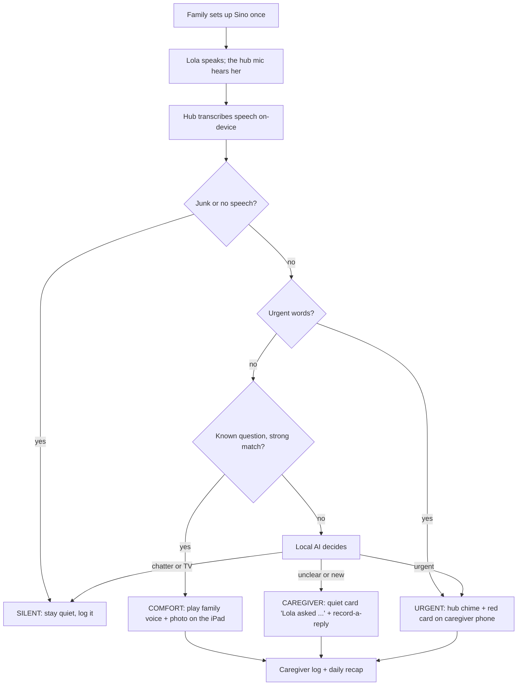

# Sino: overview

> *Kapag nagtanong ulit si Lola, boses ng pamilya ang sasagot.*
> *When Lola asks again, her family's voice answers.*

**Status:** idea locked Fri Oct 9 (see the decision log in [../NOTES.md](../NOTES.md)). This folder is the **locked spec**. Application code follows it.

**One line:** Sino is a small home hub that answers Lola's repeated questions with her family's own recorded voice and photo. It decides when to comfort her, when to get the caregiver, and when to raise an alarm, and it keeps working with no internet.

**Challenge fit** (official challenge text from [../00-event.md](../00-event.md)): "Build an AI product that remains genuinely useful when the cloud disappears." An always-on mic in Lola's sala must never stream anywhere, so Sino's core path needs no cloud at all. Speech recognition and the decision model run on a home device, and it keeps working with the internet off.

## The problem

- A lola with dementia asks "Nasaan si Nanay?" many times in one afternoon.
- Correcting her ("patay na po si Nanay") can make her grieve all over again. Answering every time wears out the caregiver.
- Reassuring instead of correcting (validation) is a common caregiver approach, but a tired family can't do it perfectly every time. *(TODO: add a citable source before the pitch.)*

**Caregiver line:** TODO — one real quote from a caregiver/nurse we talk to before 7 AM, with permission. Do not invent a quote or a statistic.

**Users:** the caregiver and family (primary: they set it up and get alerts), and Lola (she hears and sees the replies).

## How it works

## What makes it different

1. **Real family voices, never cloned or synthetic.** Every reply is a recording a family member made.
2. **Silence is a decision.** Sino ignores TV and chatter, speaks only to known questions, and sends new or urgent ones to a human.
3. **The family writes every reply** in quick setup, so the AI never invents facts about the family.
4. **Every decision is visible.** On `/backstage`, each utterance is transcript, then rule or model, then action, confidence, reason, and milliseconds ([architecture.md](architecture.md#backstage-proof)).

## Safety rules

These hold everywhere (details in [features.md](features.md)):

1. Urgent words **always** alert. The AI can escalate a decision, never downgrade it.
2. Medication questions are **never answered** by Sino. They always go to the caregiver.
3. If the matcher misses and the model says it's chatter, Sino stays silent. If the model errors or times out, it goes to the caregiver. It never guesses an answer to Lola.
4. **No cloned or synthetic family voices.** Lola only hears recordings the family made themselves.

## Why local (submission answer)

> An always-on mic in Lola's sala must never stream anywhere. Sino hears her, decides, and answers entirely inside the house, so a family's voices and their lola's hardest moments never leave home, and it keeps working when the internet is down. Local AI also lets us keep it careful: if it isn't sure what she's asking, it stays silent instead of guessing.

Official "why local" reasons this maps to ([../00-event.md](../00-event.md)): **private** (always-on mic in a home) and **impossible** without connectivity (internet down). We don't claim it's faster than the cloud. Don't lead with brownouts or typhoons; mention "runs on battery" only if the hub is shown unplugged.

## Files in this folder

| File | What it covers | Owner |
|---|---|---|
| [README.md](README.md) | This page: problem, flow, why local, source-of-truth rules | Troy |
| [features.md](features.md) | MVP (incl. quick setup), should, add-ons behind the cut line, next steps; seeded replies; UX rules | Troy (scope), Ayen (onboarding) |
| [architecture.md](architecture.md) | Devices, viewports, network, models, interfaces, data flow, offline guarantees, privacy, to-verify list | Donita (hub), Troy (decision engine) |
| [mvp-plan.md](mvp-plan.md) | Timeline, checkpoints, sprints per person, sync points, task graph | Troy |
| [demo.md](demo.md) | 5-minute pitch script, "Sino ka?" roleplay, "Nasaan si Lola?", airplane-mode fallbacks | Viviene (visuals), Troy (script) |
| [judge-qa.md](judge-qa.md) | Judge Q&A answers, risks and mitigations | Troy |
| [DONITA-SETUP.md](DONITA-SETUP.md) | M2 hub installs and offline smoke test | Donita |
| [hub-chime.md](hub-chime.md) | Urgent chime: `afplay` on the hub, red card second, `/lola` never red, 1:00 AM test | Donita |
| [task-graph.mmd](task-graph.mmd), [task-graph.png](task-graph.png) | Task dependencies (source and rendered image) | Troy |

## Source of truth / do not invent

These docs are the only source of truth for Sino. People and AI tools must follow these rules:

- **Cite the doc.** When you state a fact about Sino (hardware, model, owner, rule, number), name the file it comes from, e.g. "per `docs/sino/architecture.md`".
- **Unknown means TODO, never a guess.** If a fact isn't in these docs or in `docs/00-event.md`, write `TODO:` and ask the team. Don't fill gaps with plausible numbers, names, or features.
- **Unmeasured numbers are labeled.** Latency, accuracy on Lola's Taglish, cold-start time, and match confidence are **to verify at smoke test** until a real measurement is logged in `docs/NOTES.md`. Never present them as results. Faking benchmarks is a disqualifier ([../00-event.md](../00-event.md)).
- **Scope lives in [features.md](features.md).** Anything not listed there isn't built. New ideas go to "Next steps".
- **Official rules live in [../00-event.md](../00-event.md).** If this folder disagrees with it, 00-event wins; flag the conflict.
