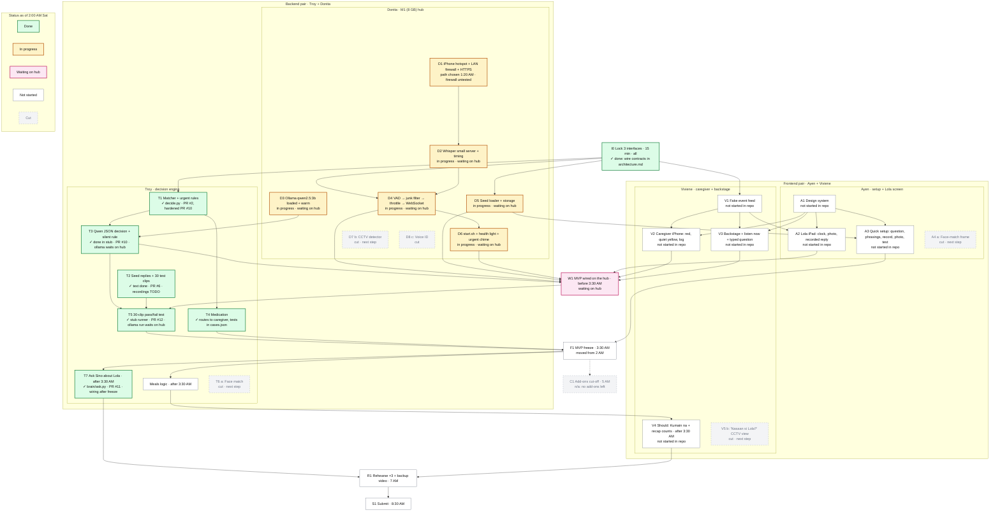

# Sino: MVP plan, sprints, and task graph

This is the **2:00 AM Sat plan (rev 3)**. It keeps the 10:30 PM Fri sprint plan (rev 2) and applies Troy's 2:00 AM decisions: pairs changed at 1:51 AM, the MVP freeze moves to **3:30 AM**, and face match (T6, A4), the CCTV add-on (D7, V5), voice ID (D8), and the live call are cut. Decision log: [../NOTES.md](../NOTES.md#decision-log). Scope: [features.md](features.md). Team-wide deadlines: [../00-event.md](../00-event.md) and [../01-team.md](../01-team.md).

Time estimates are rough and not benchmarked: **MVP ≈ 3.5 h of parallel work** (about 13 person-hours). There are no add-ons left after the freeze, only Should items.

## Owners

Pairs since 1:51 AM Sat: **Troy + Donita on the backend** (hub + brain), **Ayen + Viviene on the frontend** (`/lola`, `/setup`, `/caregiver`, `/backstage`).

| Who | Part | Owns |
|---|---|---|
| **Troy** (backend pair) | Backend: decision engine | `decide()`: matcher, urgent rules, Qwen prompt and JSON, silent rule, medication logic, seed replies, 30-clip test; his "Sino ka?" recording; after the 3:30 AM freeze, T7 wiring (`answer_about_lola` is already in `brain/ask.py`) and meals logic (T4m). T6 face match is cut |
| **Donita** (backend pair) | Backend: M1 (8 GB) hub | Network + firewall test, HTTPS, Whisper + model timing, Ollama, VAD, junk-line filter, throttle, `/listen` + WebSocket events, storage, `start.sh` + health light, urgent chime. D7 CCTV detector and D8 voice ID are cut |
| **Ayen** (frontend pair) | Frontend: setup + Lola | Design system, Lola's iPad screen, quick setup (the onboarding), recording and photo upload. A4 (the face-match frame) is cut |
| **Viviene** (frontend pair) | Frontend: caregiver + judges | Fake event feed, caregiver iPhone app, behind-the-scenes screen (incl. "listen now" and typed question), Should items after the freeze (Kumain na, recap counts, Ask Sino about Lola on `/caregiver`). V5 is cut |

**Working rules:** each person keeps their own folder and branch (`brain/`, `hub/`, `web/setup`, `web/caregiver`), with small merges to main. Frontends build against the fake feed, so nobody waits. Only interface changes ([architecture.md](architecture.md#the-3-interfaces-locked-in-the-first-15-minutes)) get posted in the team chat.

## Timeline (Fri Oct 9 to Sat Oct 10, PH time)

| By | Done |
|---|---|
| 10:45 PM | Interfaces locked (I0). Done |
| **11:15 PM** | **Network checkpoint: path chosen late, 1:20 AM.** Internet Sharing failed (needs an upstream). Primary: iPhone 15 hotspot + LAN-only `pf` firewall on the hub; backups: spare router/pocket Wi-Fi with no WAN → iPhone USB + Internet Sharing + firewall → venue Wi-Fi + firewall ([architecture.md](architecture.md#network)). mkcert cert for the hub IP. Firewall untested as of 2:00 AM |
| **11:30 PM** | **Speech model picked:** 8 GB hub → Whisper small + qwen2.5:3b; medium + qwen2.5:1.5b only if small's Tagalog is unusable (timed on a 4 s clip); RAM rule applied ([architecture.md](architecture.md#speech-model-selection-by-1130-pm)). Timing results: TODO, not in NOTES yet |
| 12:30 AM | End to end: hub mic → iPad plays a reply. **Missed: the hub is not up yet (2:00 AM).** Now due before the 3:30 AM freeze |
| **1:00 AM** | `start.sh` + health light work, so anyone can restart the hub. **Missed (hub not up).** The 1:00 AM sleep handoff did not happen: sleep shifts are TODO: re-decide ([../01-team.md](../01-team.md#sleep-shifts-cross-pair)) |
| 1:15 AM | Decision model wired, caregiver alerts and urgent chime working. Decision code done in stub mode (PRs #10–#12); hub side missed, now due before 3:30 AM |
| 1:45 AM | 30-clip test passes (or fall back to rules + matcher); quick setup works on the real hub. Stub-mode text run done (see the gate below); hub run waiting on the hub |
| **2:00 AM** | Decisions (Troy): freeze moved to 3:30 AM, pairs changed, live call cut, T6 face match and add-on (b) CCTV cut ([../NOTES.md](../NOTES.md#decision-log)) |
| **3:30 AM** | **MVP freeze (F1).** Core protected until then: the hub hears, transcribes, and runs `decide()`; a known question gets the recorded voice + photo on the iPad; urgent gets the hub chime + red card; TV stays silent and `/backstage` shows decisions; quick setup works live with "Nasaan yung aso?". Then Should: T7 Ask Sino about Lola wiring (code already merged), meals (T4m), recap counts (V4) |
| 5:00 AM | Add-ons cut-off (C1): **n/a**, no add-ons are left |
| 7:00 AM | Team feature freeze. 3 timed rehearsals with no internet + backup video. 7 to 8 AM: rehearse only |
| 8:00 AM | Repo public |
| **8:30 AM** | **Submit** (official hard deadline 10:00 AM, no extensions) |
| 12:00 PM | On-site at Cyberzone, SM Makati |

## Pass/fail gate (T5, before the 3:30 AM freeze)

30 labeled clips. Pass = **urgent 10/10**, **comfort ≥ 8/10**, **0 false triggers on TV clips**, **known questions ≤ 3 s** speech to reply (model-path latency logged; expected 4 to 5 s, to verify). If it fails, ship rules + matcher and use the model only for the caregiver path. The gate is met only by a run on the hub in `ollama` mode with audio; the exact time of that run is TODO (it must land before the 3:30 AM freeze).

Write the run to `docs/NOTES.md` and show it on `/backstage`. Until a real hub run is logged, the hub figures stay TODO. Do not fill these in early.

| Field | Stub mode, text only (Troy's Mac, Sat ~2:00 AM, `brain/tests/run_t5.py`) | Hub, `ollama` mode |
|---|---|---|
| urgent | 34/34 | TODO |
| comfort | 37/37 | TODO |
| TV false triggers | 0 | TODO |
| new questions | 11/11 | TODO |
| speech-to-reply latency | TODO: unknown (no audio) | TODO |
| mode | `stub` | `ollama` |

The stub run checks the rules and the matcher only: `SINO_MODEL=stub` never calls the model, so lines the rules and matcher miss go to the caregiver. It is **not a pass**; the runner prints `PENDING (latency TODO: unknown)`. `cases.json` has 96 text rows (34 urgent, 37 comfort, 8 TV, 11 new, 6 "sakit ng loob"), not 30 audio clips.

`/backstage` shows a small badge. The badge text is `Test: passed <time of the logged run>` only after `docs/NOTES.md` records a hub pass. Until then the badge shows the TODO figures and does not say passed. A stub run never turns it on.

TODO (Troy): fix the 30-clip audio mix (how many urgent / comfort / TV / new-question clips).

## Sprints per person

Each sprint ends with something demoable. If you finish early, pull the next sprint or help the person behind. Times before 2:00 AM are the rev 2 plan; anything marked missed is now due before the 3:30 AM freeze.

### Troy: decision engine

**T7 `answer_about_lola(question, log)`** is Should, after the 3:30 AM freeze. The code is already merged (`brain/ask.py`, PR #11, 9/9 cases in stub mode); what is left is wiring it to `/caregiver` (contract gap in [architecture.md](architecture.md#the-3-interfaces-locked-in-the-first-15-minutes)). The intent is one of `how`, `saying`, or `where`. The rules run first. Qwen only picks the intent, and it returns JSON only. Code builds the answer from the log: counts, her exact words, and the last urgent. `where` returns the no-camera answer, because add-on (b) is cut. Never a diagnosis or a mood.

| Sprint | Time | Deliver | Done when |
|---|---|---|---|
| S1 | 10:30–11:15 | I0 interfaces + T1 matcher + urgent rules | `decide("Si Mama asan?")` = comfort, `"masakit dibdib"` = urgent. **Done** (PR #2) |
| S2 | 11:15–12:15 | T2 seed questions + replies (incl. "Nasaan si Nanay?" and "Nasaan si Joy?") + 30 test clips (with the team) | Text done (PR #6, 5 questions). Recordings TODO: Joy's four replies + Troy's "Sino ka?" line. Audio clips in `brain/tests/clips`: TODO |
| S3 | 12:15–1:15 | T3 Qwen JSON decision + silent rule, T4 medication | **Done in stub mode** (PR #10): unclear lines go to caregiver; silent only at model confidence ≥ 0.8; medication never answered. `ollama` mode waits on the hub |
| S4 | 1:15–2:00 | T5 pass/fail test, tune thresholds | **Runner done** (PR #12), stub results in the gate above. Hub `ollama` run waits on the hub, before 3:30 AM |
| S5 | 2:00–3:30 | With Donita: get the hub up, run T5 on the hub, wire `decide()` to the WebSocket; record "Sino ka?" | Core above works on the hub by the freeze |
| S6 | after 3:30 | Should: T7 wiring and meals logic (T4m) | `answer_about_lola("Kamusta si Lola?")` returns log counts on `/caregiver`; `answer_about_lola("Nasaan si Lola?")` returns the no-camera answer; "Kumain na ba ako?" answers from the log |
| Cut | | T6 face match | Next step |
| Sleep | TODO: re-decide | | |

### Donita: M1 (8 GB) hub

| Sprint | Time | Deliver | Done when |
|---|---|---|---|
| S1 | 10:30–11:15 (D1 path chosen late, 1:20 AM) | D1 iPhone hotspot + LAN-only firewall + mkcert HTTPS ([DONITA-SETUP.md](DONITA-SETUP.md#5-network-d1)), D3 Ollama warm | iPad + iPhone open the https page; `curl -m 3 https://google.com` fails on the hub; ping to the iPad works. **Firewall untested as of 2:00 AM** |
| S2 | 11:15–12:15 | D2 Whisper + model timing (by 11:30), D4 VAD → junk filter → throttle → /listen → WebSocket, D5 seed loader + storage | Speaking near the hub shows the transcript on backstage; TV sign-off lines are dropped; seed loader done (A3 needs it). In progress, hub not up as of 2:00 AM |
| S3 | 12:15–1:00 | D6 `start.sh` + health light + urgent chime | Anyone can restart the hub; the chime test in [hub-chime.md](hub-chime.md) passes. In progress |
| S4 | 2:00–3:30 | With Troy: finish D1–D6 so the core runs on the hub by the freeze | Core above works on the hub |
| Cut | | D7 CCTV detector, D8 voice ID | Next steps |
| Sleep | TODO: re-decide | | Hub left running; handoff note in `docs/NOTES.md` |
| S5 | 6:30–8:30 | Rehearse, README disclosures, submit | Submitted |

### Ayen: setup + Lola's screen

| Sprint | Time | Deliver | Done when |
|---|---|---|---|
| S1 | 10:30–11:15 | A1 design system (tokens, components) | Shared Tailwind theme pushed. Not in the repo yet (2:00 AM) |
| S2 | 11:15–12:15 | A2 Lola iPad screen: big clock, idle photo, full-screen reply | Plays a reply from the fake feed. Not in the repo yet |
| S3 | 12:15–1:45 | A3 quick setup: add question, two phrasings, hold to record, photo, test | A new question added on the iPhone is answered on the iPad. Not in the repo yet |
| S4 | before 3:30 | With Viviene: check A2 + A3 on the real devices against the hub | Freeze-ready |
| Cut | | A4 face-match frame | Next step. "Sino ka?" is a normal reply on A2: photo + recorded line |
| Sleep | TODO: re-decide | | |
| S6 | 7:00–8:30 | Rehearse, demo video visuals | Video exported |

### Viviene: caregiver + backstage

| Sprint | Time | Deliver | Done when |
|---|---|---|---|
| S1 | 10:30–11:00 | V1 fake event feed | All screens can build against it. Not in the repo yet (2:00 AM) |
| S2 | 11:00–12:15 | V2 caregiver phone: red card with sound, quiet yellow with grouped repeats + record-a-reply, green log | Works on the iPhone with the fake feed. Not in the repo yet |
| S3 | 12:15–1:00 | V3 backstage: transcript → rule or model → action, confidence, reason, ms; dropped row; `TV lines ignored: N`; T5 badge; OFFLINE; health light; "listen now"; typed question | Updates live from the real hub ([architecture.md](architecture.md#backstage-proof)). Not in the repo yet |
| S4 | after 3:30 | V4 Should: Kumain na + recap counts; Ask Sino about Lola on `/caregiver` (with Troy's T7 wiring) | Recap shows real counts |
| Cut | | V5 "Nasaan si Lola?" CCTV view | Next step |
| Sleep | TODO: re-decide | | Handoff note in `docs/NOTES.md` |
| S5 | 6:30–8:30 | Pitch visuals, submission post graphic, rehearse | Post ready |

**Sync points (5 min each):** 11:15 PM (interfaces + network), 11:30 PM (speech model), 1:00 AM (MVP wired + restart works; missed), 2:00 AM (rev 3 decisions), 3:30 AM (freeze, F1), 7:00 AM (rehearse). Other sync times: TODO: re-decide with the sleep shifts.

Sleep shifts: the cross-pair shifts in [../01-team.md](../01-team.md) (Donita + Viviene 1:00–4:30 AM, Troy + Ayen 4:30–7:00 AM) were built on the old pairing and the 1:00 AM handoff did not happen. **TODO: re-decide.**

## Task graph

Arrows show what needs what. Cut tasks (T6, A4, D7, V5, D8) are drawn, marked cut, and do not start. Tasks with no incoming arrow can start right away.

**Start immediately (no prerequisites):** T1, T2, D1, D3, A1, V1.

**Status as of 2:00 AM Sat. Hub: MacBook Air M1 8 GB.** Colours: Done / In progress / Waiting on hub / Not started / Cut (legend in the image). Done: I0, T1, T2 (text; recordings TODO), T4, T3 and T5 in stub mode (PRs #10 and #12; `ollama` mode waits on the hub), T7's `brain/ask.py` (PR #11; wiring after the freeze), the spec docs. In progress: Donita's D1 (path chosen, firewall untested) to D6, with Troy, while the M1 hub is set up. Waiting on hub: W1, T5 in `ollama` mode. Not started in the repo: Ayen's and Viviene's tasks (nothing of theirs is on `main` yet). Cut: T6, A4, D7, V5, D8.

Source: [task-graph.mmd](task-graph.mmd) (Mermaid, renders on GitHub):

