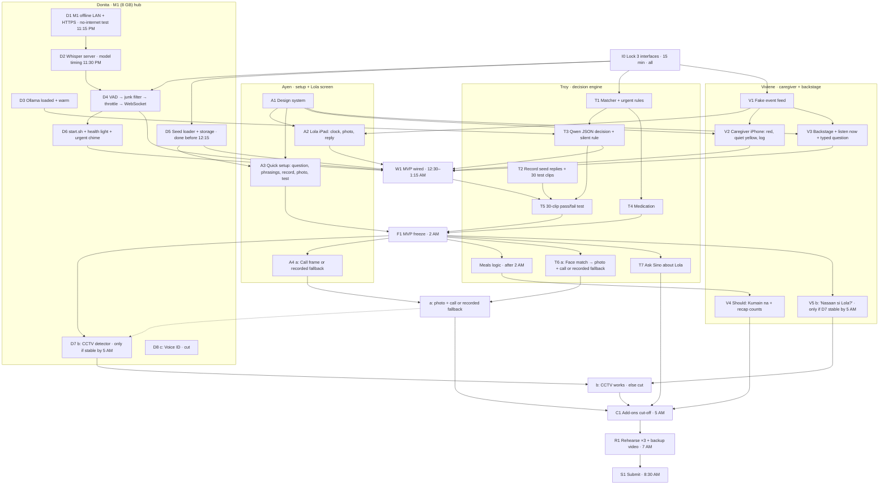

# Sino: MVP plan, sprints, and task graph

This is the **10:30 PM Fri plan (rev 2)**. It replaces the earlier checkpoints (8:15 PM interfaces, 10 PM wire-up, 11 PM pass/fail). Scope: [features.md](features.md). Team-wide deadlines and sleep shifts: [../00-event.md](../00-event.md) and [../01-team.md](../01-team.md).

Time estimates are rough and not benchmarked: **MVP ≈ 3.5 h of parallel work** (about 13 person-hours), plus add-ons after.

## Owners

| Who | Part | Owns |
|---|---|---|
| **Troy** | Backend: decision engine | `decide()`: matcher, urgent rules, Qwen prompt and JSON, silent rule, medication logic, seed replies, 30-clip test; after the 2 AM freeze, meals logic (T4m) and T7 `answer_about_lola` (2:00–3:00, before T6); add-on (a) T6 face match → photo + house-Wi-Fi call, or the recorded fallback (3:00–4:30, first to cut) |
| **Donita** | Backend: M1 (8 GB) hub | Network + no-upstream test, HTTPS, Whisper + model timing, Ollama, VAD, junk-line filter, throttle, `/listen` + WebSocket events, storage, `start.sh` + health light, urgent chime; add-on (b) detector only if stable by 5:00 AM; (c) voice ID is cut |
| **Ayen** | Frontend: setup + Lola | Design system, Lola's iPad screen, quick setup (the onboarding), recording and photo upload; add-on (a) the frame and the call on the iPad, or the recorded "Sino ka?" fallback |
| **Viviene** | Frontend: caregiver + judges | Fake event feed, caregiver iPhone app, behind-the-scenes screen (incl. "listen now" and typed question), Should items (Kumain na, recap counts); add-on (b) view |

**Working rules:** each person keeps their own folder and branch (`brain/`, `hub/`, `web/setup`, `web/caregiver`), with small merges to main. Frontends build against the fake feed, so nobody waits. Only interface changes ([architecture.md](architecture.md#the-3-interfaces-locked-in-the-first-15-minutes)) get posted in the team chat.

## Timeline (Fri Oct 9 to Sat Oct 10, PH time)

| By | Done |
|---|---|
| 10:45 PM | Interfaces locked (I0) |
| **11:15 PM** | **Network checkpoint: done late, 1:20 AM.** Internet Sharing failed (needs an upstream). Primary: iPhone 15 hotspot + LAN-only `pf` firewall on the hub; backups: spare router/pocket Wi-Fi with no WAN → iPhone USB + Internet Sharing + firewall → venue Wi-Fi + firewall ([architecture.md](architecture.md#network)). mkcert cert for the hub IP |
| **11:30 PM** | **Speech model picked:** 8 GB hub → Whisper small + qwen2.5:3b; medium + qwen2.5:1.5b only if small's Tagalog is unusable (timed on a 4 s clip); RAM rule applied ([architecture.md](architecture.md#speech-model-selection-by-1130-pm)); results in NOTES |
| 12:30 AM | End to end: hub mic → iPad plays a reply |
| **1:00 AM** | `start.sh` + health light work, so anyone can restart the hub; Donita and Viviene hand off and sleep |
| 1:15 AM | Decision model wired, caregiver alerts and urgent chime working |
| 1:45 AM | 30-clip test passes (or fall back to rules + matcher); quick setup works on the real hub |
| **2:00 AM** | **MVP freeze (F1).** Then Should: T7 Ask Sino about Lola (2:00–3:00) and meals (T4m), then add-on (a) T6 (3:00–4:30, first to cut if 4:30 slips). Then (b) only if stable by 5:00 AM. (c) voice ID is cut |
| 3:00 AM | T7 done. T6 starts |
| 5:00 AM | Add-ons cut-off (C1). T7 is on this path (F1 → T7 → C1) |
| 7:00 AM | Team feature freeze. 3 timed rehearsals with no internet + backup video. 7 to 8 AM: rehearse only |
| 8:00 AM | Repo public |
| **8:30 AM** | **Submit** (official hard deadline 10:00 AM, no extensions) |
| 12:00 PM | On-site at Cyberzone, SM Makati |

## Pass/fail gate (T5, by 1:45 AM)

30 labeled clips. Pass = **urgent 10/10**, **comfort ≥ 8/10**, **0 false triggers on TV clips**, **known questions ≤ 3 s** speech to reply (model-path latency logged; expected 4 to 5 s, to verify). If it fails, ship rules + matcher and use the model only for the caregiver path.

Write the run to `docs/NOTES.md` and show it on `/backstage`. Until a real run is logged, every figure stays TODO. Do not fill these in early.

| Field | Until measured |
|---|---|
| urgent | TODO/10 |
| comfort | TODO/10 |
| TV false triggers | TODO |
| mode | TODO (`ollama` or `stub`) |

`mode` is `ollama` when Qwen via Ollama decided the unclear lines, and `stub` when it did not. Anything the stub does beyond the existing rule (model error or timeout goes to the caregiver) is `TODO: unknown`.

`/backstage` shows a small badge. The badge text is `Test: passed 1:45 AM` only after `docs/NOTES.md` records a pass. Until then the badge shows the TODO figures above and does not say passed.

TODO (Troy): fix the clip mix (how many urgent / comfort / TV / new-question clips).

## Sprints per person

Each sprint ends with something demoable. If you finish early, pull the next sprint or help the person behind.

### Troy: decision engine

**T7 `answer_about_lola(question)`** is Should, after the 2 AM freeze (2:00–3:00), before T6. The intent is one of `how`, `saying`, or `where`. The matcher and rules run first. Qwen only picks the intent, and it returns JSON only. Code builds the answer from the log: counts, her exact words, and the last urgent. `where` reads add-on (b)'s last-seen log, or returns "no camera answer". Never a diagnosis or a mood.

| Sprint | Time | Deliver | Done when |
|---|---|---|---|
| S1 | 10:30–11:15 | I0 interfaces + T1 matcher + urgent rules | `decide("Si Mama asan?")` = comfort, `"masakit dibdib"` = urgent |
| S2 | 11:15–12:15 | T2 record seed replies (incl. "Nasaan si Nanay?" and "Nasaan si Joy?") + 30 test clips (with the team) | Clips labeled in `brain/tests/clips` |
| S3 | 12:15–1:15 | T3 Qwen JSON decision + silent rule, T4 medication | Unclear lines go to caregiver; chatter stays silent; medication never answered |
| S4 | 1:15–2:00 | T5 pass/fail test, tune thresholds | Gate above passes, or fallback chosen |
| S5 | 2:00–3:00 | Should: T7 Ask Sino about Lola, and meals logic (T4m) in the same hour | `answer_about_lola("Kamusta si Lola?")` returns log counts; `answer_about_lola("Nasaan si Lola?")` with (b) off returns the no-camera answer; "Kumain na ba ako?" answers from the log |
| S5 | 3:00–4:30 | Add-on (a): T6 face match → photo + call on the house Wi-Fi, or the recorded "Sino ka?" fallback. First to cut if this window slips | Registered face → photo and a house-Wi-Fi call, or the line they recorded in setup; stranger → no name and no call |
| Sleep | 4:30–7:00 | | |

### Donita: M1 (8 GB) hub

| Sprint | Time | Deliver | Done when |
|---|---|---|---|
| S1 | 10:30–11:15 (D1 done late, 1:20 AM) | D1 iPhone hotspot + LAN-only firewall + mkcert HTTPS ([DONITA-SETUP.md](DONITA-SETUP.md#5-network-d1)), D3 Ollama warm | iPad + iPhone open the https page; `curl -m 3 https://google.com` fails on the hub; ping to the iPad works |
| S2 | 11:15–12:15 | D2 Whisper + model timing (by 11:30), D4 VAD → junk filter → throttle → /listen → WebSocket, D5 seed loader + storage | Speaking near the hub shows the transcript on backstage; TV sign-off lines are dropped; seed loader done before 12:15 (A3 needs it) |
| S3 | 12:15–1:00 | D6 `start.sh` + health light + urgent chime | Anyone can restart the hub; the 1:00 AM chime test in [hub-chime.md](hub-chime.md) passes |
| Sleep | 1:00–4:30 | | Hub left running; handoff note in `docs/NOTES.md` |
| S4 | 4:30–5:00 | Add-on (b): D7 CCTV detector, only if stable by 5:00. (c) D8 voice ID is cut | "Nasa kusina" answer computed from the clip only if (b) is stable; otherwise cut |
| S5 | 6:30–8:30 | Rehearse, README disclosures, submit | Submitted |

### Ayen: setup + Lola's screen

| Sprint | Time | Deliver | Done when |
|---|---|---|---|
| S1 | 10:30–11:15 | A1 design system (tokens, components) | Shared Tailwind theme pushed |
| S2 | 11:15–12:15 | A2 Lola iPad screen: big clock, idle photo, full-screen reply | Plays a reply from the fake feed |
| S3 | 12:15–1:45 | A3 quick setup: add question, two phrasings, hold to record, photo, test | A new question added on the iPhone is answered on the iPad |
| S4 | 1:45–2:00 | Check A2 + A3 on the real devices | Freeze-ready |
| S5 | 2:00–4:30 | Add-on (a): A4 frame and call on the iPad | Photo, then a house-Wi-Fi call, or the "Sino ka?" line they recorded in setup. Never a quiz. Lola's iPad stays calm and never red |
| Sleep | 4:30–7:00 | | |
| S6 | 7:00–8:30 | Rehearse, demo video visuals | Video exported |

### Viviene: caregiver + backstage

| Sprint | Time | Deliver | Done when |
|---|---|---|---|
| S1 | 10:30–11:00 | V1 fake event feed | All screens can build against it |
| S2 | 11:00–12:15 | V2 caregiver phone: red card with sound, quiet yellow with grouped repeats + record-a-reply, green log | Works on the iPhone with the fake feed |
| S3 | 12:15–1:00 | V3 backstage: transcript → rule or model → action, confidence, reason, ms; dropped row; `TV lines ignored: N`; T5 badge; OFFLINE; health light; "listen now"; typed question | Updates live from the real hub ([architecture.md](architecture.md#backstage-proof)) |
| Sleep | 1:00–4:30 | | Handoff note in `docs/NOTES.md` |
| S4 | 4:30–5:00 | V4 Should: Kumain na + recap counts; add-on (b) V5 "Nasaan si Lola?" only if D7 is stable by 5:00 | Recap shows real counts; last-seen room shows only if (b) is stable |
| S5 | 6:30–8:30 | Pitch visuals, submission post graphic, rehearse | Post ready |

**Sync points (5 min each):** 11:15 PM (interfaces + network), 11:30 PM (speech model), 1:00 AM (MVP wired + restart works, before Donita and Viviene sleep), 2:00 AM (freeze, F1), 3:00 AM (T7 done, T6 starts), 4:30 AM (handoff; cut T6 if it slipped), 7:00 AM (rehearse).

Sleep shifts follow [../01-team.md](../01-team.md): Donita + Viviene 1:00–4:30 AM, Troy + Ayen 4:30–7:00 AM. Add-ons land on whoever is awake; each has a fallback.

## Task graph

Arrows show what needs what. Dotted arrows show add-on order (a → b). (c) voice ID is cut: D8 is drawn and marked cut, and it does not start. Tasks with no incoming arrow can start right away, except D8.

**Start immediately (no prerequisites):** T1, T2, D1, D3, A1, V1.

Source: [task-graph.mmd](task-graph.mmd) (Mermaid, renders on GitHub):

